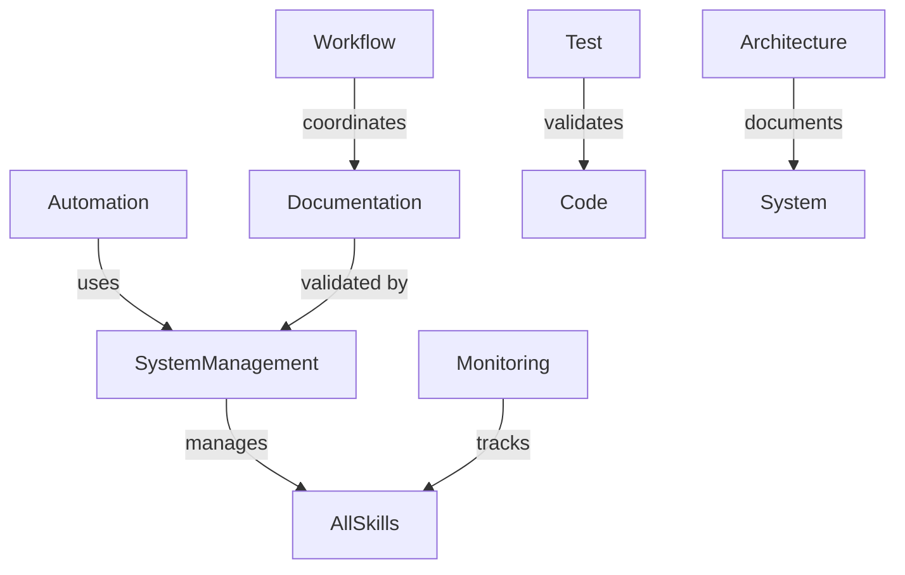

# 🎯 AI Council Skills Overview

This document provides a high-level summary of all available skills in the AI Council system, their purposes, and when to use them.

## 📚 Skill Categories

### 🔧 **Core System Skills**

#### **System Management Skill**
**Location:** `.vibe/skills/system_management_skill/`
**Purpose:** Core system management and skill registry operations
**Use Cases:**
- Registering new skills in the system
- Validating skill structure and metadata
- Managing skill versions and dependencies
- System-wide validation and testing

**Key Scripts:**
- `skill_registrar.sh` - Register new skills
- `skill_validator.sh` - Validate skill structure
- `skill_parser.sh` - Parse SKILL.md metadata
- `skill_scanner.sh` - Discover available skills

**When to Use:**
- When adding new skills to the system
- During system maintenance and updates
- For skill registry management

---

#### **Automation Skill**
**Location:** `.vibe/skills/automation_skill/`
**Purpose:** Session management, status tracking, and workflow automation
**Use Cases:**
- Starting and ending development sessions
- Checking project status and progress
- Updating session logs with structured entries
- Automating repetitive workflow tasks

**Key Scripts:**
- `start_session.sh` - Initialize development sessions
- `status.sh` - Comprehensive project status reporting
- `update_log.sh` - Create structured session log entries
- `auto_update.sh` - Automated update tasks

**When to Use:**
- At the beginning of each development session
- To check project health and metrics
- After completing work to log progress
- For automated workflow management

---

### 📝 **Documentation Skills**

#### **Documentation Skill**
**Location:** `.vibe/skills/doc_skill/`
**Purpose:** Documentation quality enforcement and validation
**Use Cases:**
- Markdown linting and formatting checks
- Documentation structure validation
- Template generation for new documents
- Ensuring consistent documentation quality

**Key Scripts:**
- `lint_docs.sh` - Run markdown linting
- `check_docs.sh` - Validate documentation structure
- `generate_template.sh` - Create documentation templates

**When to Use:**
- Before committing documentation changes
- During CI/CD pipeline execution
- When creating new documentation files
- To maintain consistent formatting standards

---

#### **Document Change Manager**
**Location:** `.vibe/skills/doc_change_manager/`
**Purpose:** Document change management workflow
**Use Cases:**
- Managing change requests for documentation
- Impact assessment of proposed changes
- Approval workflow coordination
- Change propagation across documents
- Maintaining audit trails

**Key Scripts:**
- `doc_change_manager.sh` - Main workflow controller
- `impact_assessment.sh` - Assess change impact
- `approval_coordination.sh` - Manage approvals
- `change_propagation.sh` - Propagate changes

**When to Use:**
- When modifying system documentation
- For major document updates
- When changes affect multiple files
- To maintain change history

---

### 💻 **Development Skills**

#### **Code Skill**
**Location:** `.vibe/skills/code_skill/`
**Purpose:** Python code quality checks and validation
**Use Cases:**
- Running pylint on Python source files
- Code formatting and style checks
- Type checking and static analysis
- Ensuring code quality standards

**Key Scripts:**
- `lint_code.sh` - Run pylint validation
- `check_formatting.sh` - Verify code formatting
- `type_check.sh` - Perform type checking

**When to Use:**
- Before committing code changes
- During code review process
- In CI/CD pipeline quality gates
- To maintain coding standards

---

#### **Test Skill**
**Location:** `.vibe/skills/test_skill/`
**Purpose:** Testing framework and coverage analysis
**Use Cases:**
- Executing pytest test suites
- Coverage analysis and reporting
- Test validation and quality checks
- Ensuring comprehensive test coverage

**Key Scripts:**
- `run_tests.sh` - Execute tests with coverage
- `check_coverage.sh` - Analyze test coverage
- `generate_tests.sh` - Create test templates

**When to Use:**
- During development to verify functionality
- Before merging pull requests
- In CI/CD pipeline testing phase
- To identify untested code areas

---

### 🎨 **Architecture Skills**

#### **Architecture Skill**
**Location:** `.vibe/skills/arch_skill/`
**Purpose:** Architecture validation and diagram generation
**Use Cases:**
- Generating ASCII architecture diagrams
- Validating architecture documentation
- Ensuring architectural consistency
- Visualizing system components

**Key Scripts:**
- `generate_diagram.sh` - Create architecture diagrams
- `validate_architecture.sh` - Check architecture docs
- `component_mapper.sh` - Map system components

**When to Use:**
- When designing new system components
- To document existing architecture
- For system documentation updates
- During architecture review sessions

---

### 📊 **Workflow Skills**

#### **Workflow Skill**
**Location:** `.vibe/skills/workflow_skill/`
**Purpose:** Automated workflow coordination
**Use Cases:**
- Impact assessment of changes
- Approval workflow management
- Change propagation automation
- Version updates and management
- Workflow monitoring and tracking

**Key Scripts:**
- `automated_workflows.sh` - Main workflow controller
- `impact_assessment.sh` - Assess change impact
- `approval_coordination.sh` - Manage approvals
- `change_propagation.sh` - Propagate changes
- `version_updates.sh` - Handle version updates

**When to Use:**
- For complex change management workflows
- When coordinating multi-step processes
- During document update workflows
- For version management automation

---

#### **Lab Entry Skill**
**Location:** `.vibe/skills/lab_entry/`
**Purpose:** Development tracking and lab entries
**Use Cases:**
- Managing development lab entries
- Tracking progress and decisions
- Generating structured documentation
- Maintaining development journals

**Key Scripts:**
- `lab_entry.sh` - Manage lab entries
- `progress_tracker.sh` - Track development progress
- `decision_logger.sh` - Log key decisions

**When to Use:**
- For daily development tracking
- To document research and experimentation
- During development sessions
- For progress reporting

---

### 🔍 **Monitoring Skills**

#### **Monitoring Skill**
**Location:** `.vibe/skills/monitoring_skill/`
**Purpose:** System monitoring and health tracking
**Use Cases:**
- Document health monitoring
- Version compatibility alerts
- Propagation status tracking
- Approval workflow monitoring
- Comprehensive system reporting

**Key Scripts:**
- `document_health.sh` - Check document health
- `version_alerts.sh` - Monitor version compatibility
- `propagation_tracker.sh` - Track change propagation
- `approval_monitor.sh` - Monitor approvals

**When to Use:**
- For system health checks
- During maintenance operations
- To monitor workflow progress
- For alerting and notifications

---

## 🎯 **Skill Usage Guide**

### **When to Use Which Skill**

| **Scenario** | **Recommended Skill** |
| --- | --- |
| Starting a development session | Automation Skill |
| Checking project status | Automation Skill |
| Adding new functionality | System Management Skill |
| Writing documentation | Documentation Skill |
| Modifying existing docs | Document Change Manager |
| Writing code | Code Skill |
| Testing functionality | Test Skill |
| Designing architecture | Architecture Skill |
| Managing complex workflows | Workflow Skill |
| Tracking development progress | Lab Entry Skill |
| Monitoring system health | Monitoring Skill |

### **Typical Workflow**

1. **Session Start**: Use Automation Skill to initialize
2. **Development**: Use appropriate skill for the task
3. **Testing**: Use Test Skill to verify changes
4. **Documentation**: Use Documentation Skill for quality checks
5. **Session End**: Use Automation Skill to log progress

## 🔧 **Skill Management**

### **Adding New Skills**

1. Create skill directory in `.vibe/skills/`
2. Add `SKILL.md` with proper YAML frontmatter
3. Create `scripts/` directory for automation scripts
4. Add documentation in `docs/` directory (optional)
5. Register skill using: `.vibe/skills/system_management_skill/scripts/skill_registrar.sh register <skill_dir>`

### **Skill Metadata Format**

```yaml
---
name: skill-name
description: Brief description of what the skill does
metadata:
  author: your-name
  version: "1.0.0"
  license: MIT
---
# Skill Documentation
## Purpose
Detailed purpose and usage information
```

## 📊 **Skill Relationships**



## 💡 **Best Practices**

1. **Use the right tool**: Choose the skill that best fits your current task
2. **Follow workflows**: Use Automation Skill for session management
3. **Validate early**: Run quality checks before committing
4. **Document changes**: Use Document Change Manager for significant updates
5. **Monitor progress**: Use Monitoring Skill to track system health

## 📚 **Additional Resources**

- **Skill Registry**: `.vibe/skills/skills.json` - Complete skill registry
- **Individual SKILL.md files**: Detailed documentation for each skill
- **AUTOMATION_GUIDE.md**: Comprehensive automation workflow guide
- **System Documentation**: `docs/` directory for project documentation
