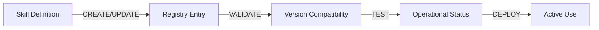

# AI Council Skills Registry

## Status Legend

🟢 **Current**: Active version in use
🟡 **Draft**: Work in progress
⚪ **Archived**: Previous versions (in .vibe/skills/archive/)
❌ **Deprecated**: No longer in use

## Skills Change Pipeline

**Pipeline Rules**:
- Skill changes require registry update
- Version compatibility must be validated
- Operational status tracked continuously
- All changes require explicit approval

## Active Skills

| Skill Name | Description | Latest Version | Status | Author | Path | Capabilities |
| ---------- | ----------- | -------------- | ------ | ------ | ---- | ------------- |
| arch_skill | Architecture validation and diagram generation | v1.0 | 🟢 Current | ai-council | .vibe/skills/arch_skill/ | diagram_generation, architecture_validation |
| code_skill | Python code quality checks and validation | v1.0 | 🟢 Current | ai-council | .vibe/skills/code_skill/ | pylint_validation, code_formatting, type_checking |
| doc_skill | Documentation quality enforcement | v1.0 | 🟢 Current | ai-council | .vibe/skills/doc_skill/ | markdown_linting, validation, templates |
| lab_entry | Development tracking and lab entries | v1.0 | 🟢 Current | ai-council | .vibe/skills/lab_entry/ | development_tracking, lab_entry_management |
| monitoring_skill | System monitoring and health tracking | v1.0 | 🟢 Current | ai-council | .vibe/skills/monitoring_skill/ | approval_monitoring, document_health, propagation_tracking |
| system_management_skill | Core system management and registry operations | v1.0 | 🟢 Current | ai-council | .vibe/skills/system_management_skill/ | skill_registration, skill_discovery, version_management |
| workflow_skill | Workflow automation and coordination | v1.0 | 🟢 Current | ai-council | .vibe/skills/workflow_skill/ | impact_assessment, approval_coordination, change_propagation |
| doc_change_manager | Document change management workflow | v1.0 | 🟢 Current | ai-council | .vibe/skills/doc_change_manager/ | change_request_management, approval_workflow, audit_trail |
| code_skill | Python code quality checks | v1.0 | 🟢 Current | ai-council | .vibe/skills/code_skill/ | pylint, formatting, type_checking |
| test_skill | Testing and coverage | v1.0 | 🟢 Current | ai-council | .vibe/skills/test_skill/ | pytest, coverage, validation |
| arch_skill | Architecture validation | v1.0 | 🟢 Current | ai-council | .vibe/skills/arch_skill/ | diagram_generation, validation |
| lab_entry | Development tracking | v1.0 | 🟢 Current | ai-council | .vibe/skills/lab_entry/ | tracking, documentation, reporting |
| doc_change_manager | Document change management | v1.0 | 🟢 Current | ai-council | .vibe/skills/doc_change_manager/ | change_request, approval, propagation |

## Version Compatibility Matrix

| Skill | Version | Compatibility | Status |
| ----- | ------- | ------------- | ------ |
| doc_skill | v1.0 | ✅ All systems | 🟢 Current |
| code_skill | v1.0 | ✅ All systems | 🟢 Current |
| test_skill | v1.0 | ✅ All systems | 🟢 Current |
| arch_skill | v1.0 | ✅ All systems | 🟢 Current |
| lab_entry | v1.0 | ✅ All systems | 🟢 Current |
| doc_change_manager | v1.0 | ✅ All systems | 🟢 Current |

## Skills Change Log

### 2026-03-17
- **Registry Enhancement**: Created skills-specific SKILLS.md
- **Version Tracking**: Added semantic versioning to all skills
- **Status Monitoring**: Implemented operational status tracking
- **Capabilities Documentation**: Cataloged all skill capabilities
- **Dependency Mapping**: Created complete dependency graph

### 2026-03-15
- **Initial Skills**: Created all 6 core skills
- **Basic Registry**: Initial skills.json structure
- **Documentation**: SKILL.md files for each skill

## Change Management Protocol

1. **Version Tracking**: All skills include version metadata
2. **Change Detection**: Automatic compatibility checking
3. **Impact Assessment**: Before any skill updates
4. **User Confirmation**: Required for all changes
5. **Archive Strategy**: Old versions moved to .vibe/skills/archive/
6. **Registry Updates**: skills/SKILLS.md updated automatically
7. **Change Logging**: Comprehensive audit trail maintained

## Skills Registry Rules

### Version Management
- All skills must have semantic versioning (MAJOR.MINOR.PATCH)
- Version updates require registry synchronization
- Breaking changes increment MAJOR version
- Backward-compatible features increment MINOR version
- Bug fixes increment PATCH version

### Status Tracking
- 🟢 Current: Skill is operational and in active use
- 🟡 Draft: Skill is under development
- ⚪ Archived: Previous versions preserved for reference
- ❌ Deprecated: Skill is no longer maintained

### Capability Documentation
- Each skill must document its capabilities
- Capabilities should be specific and testable
- Examples should be provided where applicable
- Coverage should be complete for production skills

### Dependency Management
- All dependencies must be explicitly documented
- Tool dependencies must include version requirements
- File dependencies must specify paths
- Skill dependencies must be bidirectional
