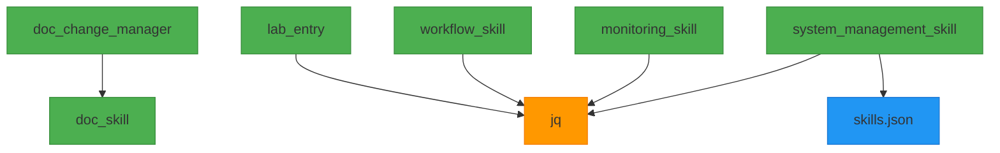

# AI Council Skills Dependency Graph

## Dependency Overview

This document visualizes and documents the dependency relationships between AI Council skills.

## Dependency Graph Visualization



**Legend**:
- 🟢 Green: AI Council Skills
- 🟠 Orange: External Tools
- → Arrow: Dependency Relationship

## Detailed Dependency Analysis

### Skill Dependencies

#### doc_change_manager
- **Depends On**: `doc_skill`
- **Reason**: Uses documentation validation during change management
- **Type**: Skill Dependency
- **Required**: Yes
- **Version**: Any v1.x

#### lab_entry
- **Depends On**: `jq` (JSON processor)
- **Reason**: Uses jq for JSON processing in lab entry management
- **Type**: Tool Dependency
- **Required**: Yes
- **Version**: Any recent version

#### workflow_skill
- **Depends On**: `jq` (JSON processor)
- **Reason**: Uses jq for JSON processing in workflow coordination
- **Type**: Tool Dependency
- **Required**: Yes
- **Version**: Any recent version

#### monitoring_skill
- **Depends On**: `jq` (JSON processor)
- **Reason**: Uses jq for JSON processing in monitoring operations
- **Type**: Tool Dependency
- **Required**: Yes
- **Version**: Any recent version

#### system_management_skill
- **Depends On**: `jq` (JSON processor), `skills.json` (registry database)
- **Reason**: Uses jq for JSON processing and manages skills.json registry
- **Type**: Tool + File Dependency
- **Required**: Yes
- **Version**: Registry v2.0, jq any recent version

### Independent Skills

#### doc_skill
- **Dependencies**: None
- **Status**: Independent
- **Notes**: Self-contained documentation validation

#### code_skill
- **Dependencies**: None
- **Status**: Independent
- **Notes**: Self-contained code quality checking

#### test_skill
- **Dependencies**: None
- **Status**: Independent
- **Notes**: Self-contained testing framework

#### arch_skill
- **Dependencies**: None
- **Status**: Independent
- **Notes**: Self-contained architecture validation

## Dependency Matrix

| Skill | Direct Dependencies | Transitive Dependencies | Total Dependencies | Dependency Depth |
| ----- | ------------------- | ----------------------- | ------------------ | ---------------- |
| doc_change_manager | 1 (doc_skill) | 0 | 1 | 1 |
| lab_entry | 1 (jq) | 0 | 1 | 1 |
| doc_skill | 0 | 0 | 0 | 0 |
| code_skill | 0 | 0 | 0 | 0 |
| test_skill | 0 | 0 | 0 | 0 |
| arch_skill | 0 | 0 | 0 | 0 |

## Dependency Types

### 1. Skill Dependencies
Dependencies on other AI Council skills:
- **Example**: `doc_change_manager` → `doc_skill`
- **Management**: Versioned through skills registry
- **Resolution**: Handled by registry system

### 2. Tool Dependencies
Dependencies on external tools and utilities:
- **Example**: `lab_entry` → `jq`
- **Management**: Documented in registry, must be installed separately
- **Resolution**: User responsibility or setup scripts

### 3. File Dependencies
Dependencies on configuration files:
- **Example**: `doc_skill` → `.markdownlint.json`
- **Management**: Documented in registry
- **Resolution**: Must be present in project

## Dependency Resolution Protocol

### Resolution Process
1. **Identify**: Determine required dependencies
2. **Check**: Verify dependencies are available
3. **Resolve**: Install or configure missing dependencies
4. **Validate**: Confirm dependencies work correctly
5. **Document**: Record dependency resolution

### Resolution Commands

```bash
# Check all dependencies
.vibe/skills/registry_utils.sh dependencies

# Show dependency graph
.vibe/skills/registry_utils.sh deps

# Validate dependency resolution
.vibe/skills/registry_utils.sh validate-all
```

## Dependency Management Best Practices

### For Skill Developers
1. **Explicit Declaration**: Always declare all dependencies
2. **Version Specification**: Specify version requirements when critical
3. **Minimal Dependencies**: Keep dependency list as small as possible
4. **Documentation**: Clearly document why each dependency is needed
5. **Testing**: Test with dependency versions specified

### For System Integrators
1. **Dependency Audit**: Review all dependencies before integration
2. **Conflict Resolution**: Handle version conflicts proactively
3. **Environment Setup**: Ensure all dependencies available
4. **Validation**: Verify dependency resolution before deployment
5. **Monitoring**: Track dependency changes over time

## Dependency Conflict Resolution

### Common Conflict Scenarios

#### 1. Version Conflicts
- **Scenario**: Two skills require different versions of same dependency
- **Resolution**: Use compatible version or update skills
- **Example**: Skill A needs jq 1.6+, Skill B needs jq 1.7+
- **Solution**: Use jq 1.7+ to satisfy both

#### 2. Missing Dependencies
- **Scenario**: Required dependency not available
- **Resolution**: Install dependency or adjust skill requirements
- **Example**: lab_entry requires jq but it's not installed
- **Solution**: Install jq or modify lab_entry to handle missing jq

#### 3. Circular Dependencies
- **Scenario**: Skill A depends on Skill B, which depends on Skill A
- **Resolution**: Restructure skills to break circularity
- **Example**: None in current system (by design)
- **Prevention**: Dependency graph validation prevents circular dependencies

## Dependency Validation

### Validation Checklist
- [x] All dependencies explicitly declared
- [x] Dependency types correctly categorized
- [x] Version requirements specified where needed
- [x] No circular dependencies exist
- [x] All dependencies documented in registry
- [x] Dependency resolution tested
- [x] Conflict resolution procedures documented

### Validation Commands

```bash
# Validate registry structure (includes dependency validation)
.vibe/skills/registry_utils.sh validate

# Check specific skill dependencies
.vibe/skills/registry_utils.sh show doc_change_manager

# List all skills with their dependencies
.vibe/skills/registry_utils.sh list
```

## Dependency Graph Maintenance

### Update Procedures
1. **Add Dependency**: Update skills.json and dependency_graph
2. **Remove Dependency**: Update skills.json and dependency_graph
3. **Change Version**: Update version requirements in skills.json
4. **Validate**: Run dependency validation after changes

### Change Examples

#### Adding a Dependency

```json
// Before
"dependencies": {
  "tools": [],
  "files": [],
  "skills": []
}

// After adding jq dependency
"dependencies": {
  "tools": ["jq"],
  "files": [],
  "skills": []
}
```

#### Updating Dependency Graph

```json
// Before
"dependency_graph": {
  "lab_entry": {
    "depends_on": [],
    "required_by": []
  }
}

// After adding jq dependency
"dependency_graph": {
  "lab_entry": {
    "depends_on": ["jq"],
    "required_by": []
  }
}
```

## Future Dependency Management

### Planned Enhancements
1. **Automatic Dependency Resolution**: Install missing dependencies automatically
2. **Version Conflict Detection**: Early warning system for conflicts
3. **Dependency Visualization**: Interactive dependency graph explorer
4. **Impact Analysis**: Assess impact of dependency changes
5. **Update Notifications**: Alert when dependency updates available

### Roadmap
- **v1.1**: Basic dependency resolution scripts
- **v1.2**: Automatic tool installation
- **v2.0**: Advanced dependency management system

## Troubleshooting

### Common Dependency Issues

**Issue**: Missing dependency error
- **Cause**: Required tool/skill not available
- **Solution**: Install dependency or adjust requirements
- **Prevention**: Validate dependencies before deployment

**Issue**: Version conflict warning
- **Cause**: Multiple version requirements can't be satisfied
- **Solution**: Use compatible version or update skills
- **Prevention**: Test version combinations during development

**Issue**: Circular dependency detected
- **Cause**: Skills depend on each other directly or indirectly
- **Solution**: Restructure skills to break circularity
- **Prevention**: Dependency graph validation prevents this

### Dependency Error Resolution
1. **Read Error**: Understand what's missing or conflicting
2. **Check Registry**: Verify dependency declarations
3. **Analyze Impact**: Determine what's affected
4. **Resolve**: Install, update, or adjust dependencies
5. **Test**: Confirm resolution works
6. **Document**: Record the resolution for future reference

## Best Practices Summary

### Dependency Declaration
✅ **Do**: Declare all dependencies explicitly
✅ **Do**: Specify versions when critical
✅ **Do**: Document dependency purposes
❌ **Don't**: Hide or omit dependencies
❌ **Don't**: Assume dependencies are available

### Dependency Management
✅ **Do**: Validate dependencies regularly
✅ **Do**: Test with declared dependency versions
✅ **Do**: Handle missing dependencies gracefully
❌ **Don't**: Ignore dependency warnings
❌ **Don't**: Assume versions are compatible

### System Design
✅ **Do**: Minimize dependencies
✅ **Do**: Prefer independent skills
✅ **Do**: Design for dependency flexibility
❌ **Don't**: Create unnecessary dependencies
❌ **Don't**: Create tight coupling between skills
