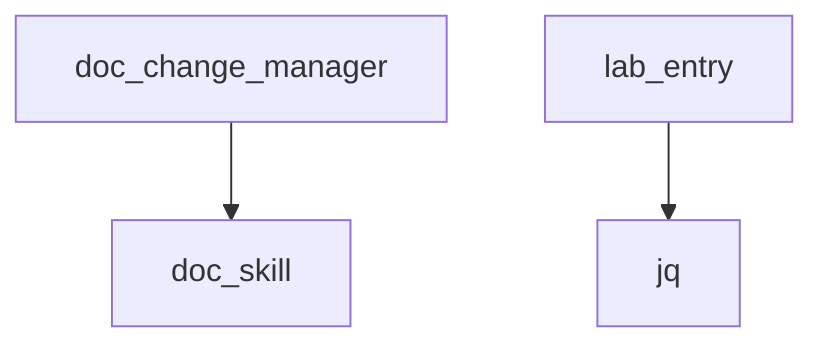

# AI Council Dependency Management System

## Overview

The AI Council Dependency Management System provides comprehensive validation, analysis, and conflict resolution for skill dependencies. This system ensures that all skills have their dependencies properly declared and validated according to semantic versioning constraints.

## Dependency Types

### 1. Tool Dependencies
External tools and utilities required by skills:
- Example: `jq`, `markdownlint`, `pylint`
- Management: Must be installed in the environment
- Validation: Presence checking

### 2. File Dependencies
Configuration files required by skills:
- Example: `.markdownlint.json`, `pyproject.toml`
- Management: Must be present in project
- Validation: File existence checking

### 3. Skill Dependencies
Dependencies on other AI Council skills:
- Example: `doc_change_manager` → `doc_skill`
- Management: Versioned through skills registry
- Validation: Version constraint checking

## Dependency Validation

### Validation Process
1. **Dependency Declaration**: Skills declare dependencies in `skills.json`
2. **Presence Checking**: Verify dependencies exist
3. **Version Validation**: Check version constraints
4. **Conflict Detection**: Identify version conflicts
5. **Resolution Suggestions**: Provide upgrade/downgrade recommendations

### Validation Commands

```bash
# Validate specific skill dependencies
.vibe/skills/dependency_checker.sh validate doc_skill

# Validate all skill dependencies
.vibe/skills/dependency_checker.sh all

# Check for dependency conflicts
.vibe/skills/dependency_checker.sh conflicts

# Analyze dependency graph
.vibe/skills/dependency_checker.sh graph
```

## Dependency Graph Analysis

### Current Dependency Graph



### Graph Analysis

```bash
.vibe/skills/dependency_checker.sh analyze
```

### Graph Metrics
- **Total Dependencies**: Count of all dependency relationships
- **Dependency Depth**: Maximum chain length
- **Circular Dependencies**: Detection and prevention

## Constraint Management

### Version Constraints
Skills can specify version constraints for their dependencies:

```json
{
  "compatibility": {
    "constraints": {
      "doc_skill": "^1.0.0",
      "code_skill": ">=1.2.0 <2.0.0"
    }
  }
}
```

### Constraint Types
- **Caret (^)**: `^1.2.3` := `>=1.2.3 <2.0.0`
- **Tilde (~)**: `~1.2.3` := `>=1.2.3 <1.3.0`
- **Comparison**: `>=`, `>`, `<=`, `<`, `=`

### Constraint Validation

```bash
# Check if version satisfies constraint
.vibe/skills/version_manager.sh constraint 1.2.5 "^1.2.3"
# ✅ true

# Validate constraints in registry
.vibe/skills/dependency_checker.sh validate doc_change_manager
```

## Conflict Detection and Resolution

### Common Conflict Types

#### 1. Version Conflicts
- **Scenario**: Skill A requires `doc_skill ^1.0.0`, Skill B requires `doc_skill ^2.0.0`
- **Detection**: Constraint validation fails
- **Resolution**: Update skills to compatible versions

#### 2. Missing Dependencies
- **Scenario**: Required skill/tool not available
- **Detection**: Dependency presence check fails
- **Resolution**: Install dependency or adjust requirements

#### 3. Circular Dependencies
- **Scenario**: Skill A → Skill B → Skill A
- **Detection**: Graph cycle detection
- **Resolution**: Restructure skills to break circularity

### Resolution Workflow
1. **Identify**: Determine conflicting dependencies
2. **Analyze**: Assess impact and alternatives
3. **Resolve**: Update versions or adjust constraints
4. **Test**: Verify resolution works
5. **Document**: Record changes

### Resolution Commands

```bash
# Get resolution suggestions
.vibe/skills/dependency_checker.sh resolve doc_change_manager

# Manual resolution steps
1. Update skills.json constraints
2. Bump dependent skill versions
3. Validate with dependency checker
4. Test affected skills
```

## Dependency Management Best Practices

### For Skill Developers
1. **Explicit Declaration**: Always declare all dependencies
2. **Minimal Dependencies**: Keep dependency list small
3. **Flexible Constraints**: Use `^` for most dependencies
4. **Documentation**: Explain why each dependency is needed
5. **Testing**: Test with declared dependency versions

### For System Integrators
1. **Dependency Audit**: Review before integration
2. **Conflict Resolution**: Handle proactively
3. **Environment Setup**: Ensure dependencies available
4. **Validation**: Verify before deployment
5. **Monitoring**: Track dependency changes

## Integration with Version Management

### Version Constraint Workflow
1. **Declare Constraints**: Add to `skills.json`
2. **Validate**: Run dependency checker
3. **Resolve Conflicts**: Adjust as needed
4. **Deploy**: Update registry
5. **Monitor**: Check for updates

### Example Workflow

```bash
# Add constraint to skill
# Edit skills.json to add constraint

# Validate constraint
.vibe/skills/dependency_checker.sh validate my_skill

# Check for updates
.vibe/skills/version_checker.sh check-updates

# Update if needed
.vibe/skills/version_manager.sh bump 1.2.3 patch

# Validate again
.vibe/skills/dependency_checker.sh all
```

## Advanced Features (Future)

### Planned Enhancements
1. **Automatic Conflict Resolution**: Suggest specific version updates
2. **Impact Analysis**: Assess change impact before updates
3. **Dependency Visualization**: Interactive graph explorer
4. **Update Simulation**: Test updates before applying
5. **Constraint Optimization**: Suggest optimal constraint ranges

### Roadmap
- **v1.1**: Basic conflict resolution
- **v1.2**: Impact analysis and simulation
- **v2.0**: Advanced dependency optimization

## Troubleshooting

### Common Issues

**Issue**: Dependency validation fails
- **Cause**: Missing dependency or version constraint violation
- **Solution**: Install dependency or adjust constraints
- **Prevention**: Validate before deployment

**Issue**: Version constraint not satisfied
- **Cause**: Installed version doesn't match constraint
- **Solution**: Update to compatible version or adjust constraint
- **Prevention**: Use flexible constraints

**Issue**: Circular dependency detected
- **Cause**: Skills depend on each other
- **Solution**: Restructure to break circularity
- **Prevention**: Design for acyclic dependencies

### Debugging Commands

```bash
# Check specific dependency
.vibe/skills/dependency_checker.sh validate my_skill

# List all dependencies
.vibe/skills/registry_utils.sh show my_skill

# Check version constraints
.vibe/skills/version_manager.sh constraint 1.2.3 "^1.0.0"
```

## Best Practices Summary

### Dependency Declaration
✅ **Do**: Declare all dependencies explicitly
✅ **Do**: Use semantic versioning constraints
✅ **Do**: Document dependency purposes
❌ **Don't**: Hide or omit dependencies
❌ **Don't**: Use overly restrictive constraints

### Dependency Management
✅ **Do**: Validate dependencies regularly
✅ **Do**: Test with declared versions
✅ **Do**: Handle conflicts proactively
❌ **Don't**: Ignore dependency warnings
❌ **Don't**: Assume versions are compatible

### System Design
✅ **Do**: Minimize dependencies
✅ **Do**: Design for flexibility
✅ **Do**: Use dependency injection
❌ **Don't**: Create tight coupling
❌ **Don't**: Create circular dependencies
