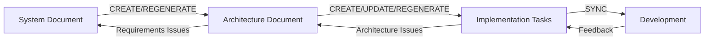

# AI Council Document Registry

## Status Legend

🟢 **Current**: Active version in use
🟡 **Draft**: Work in progress
⚪ **Archived**: Previous versions (in docs/archive/)
❌ **Deprecated**: No longer in use

## Document Change Pipeline

**Pipeline Rules**:
- System Document changes → Architecture REGENERATE required
- Architecture changes → Tasks UPDATE/REGENERATE required
- Task feedback → Appropriate document updates
- All changes require user confirmation

## Active Documents

| Document Name | Description | Latest Version | Status | Owner | Path | Change Log |
| ------------- | ----------- | -------------- | ------ | ----- | ---- | ---------- |
| System Document | User requirements and workflows | v1.1 | 🟢 Current | system_doc_creator | docs/system_document.md | See below |
| Architecture Document | Technical design and components | v2.0 | 🟢 Current | architecture_creator | docs/architecture_document.md | See below |
| Implementation Tasks | Development work breakdown | v2.0 | 🟢 Current | arch_task_generator | docs/implementation_tasks.md | See below |

## Version Compatibility Matrix

| System Doc | Architecture Doc | Tasks Doc | Compatibility Status |
| ---------- | ---------------- | --------- | ------------------- |
| v1.1 | v2.0 | v2.0 | ✅ Synchronized |
| v1.0 | v1.0 | v1.0 | ⚪ Archived |

**Compatibility Rules**:
- ✅ Green: All documents synchronized and compatible
- ⚠️ Yellow: Minor version mismatch (update recommended)
- ❌ Red: Major version mismatch (regeneration required)

## Document Change Log

### 2026-03-16
- **System Document v1.1**: Created from Overview v1.0 with complete user requirements
- **Architecture Document v2.0**: Created from System Document v1.1 with full technical design
- **Implementation Tasks v2.0**: Generated from Architecture Document v2.0
- **DOCUMENTS.md**: Updated with version tracking, status legend, and change pipeline

### 2026-03-15
- **System Document v1.0**: Initial version created
- **Architecture Document v1.0**: Initial version created
- **Implementation Tasks v1.0**: Initial version created

## Change Management Protocol

1. **Version Tracking**: All documents include version metadata
2. **Change Detection**: Automatic compatibility checking
3. **Impact Assessment**: Before any document updates
4. **User Confirmation**: Required for all changes
5. **Archive Strategy**: Old versions moved to docs/archive/
6. **Registry Updates**: docs/DOCUMENTS.md updated automatically
7. **Change Logging**: Comprehensive audit trail maintained
