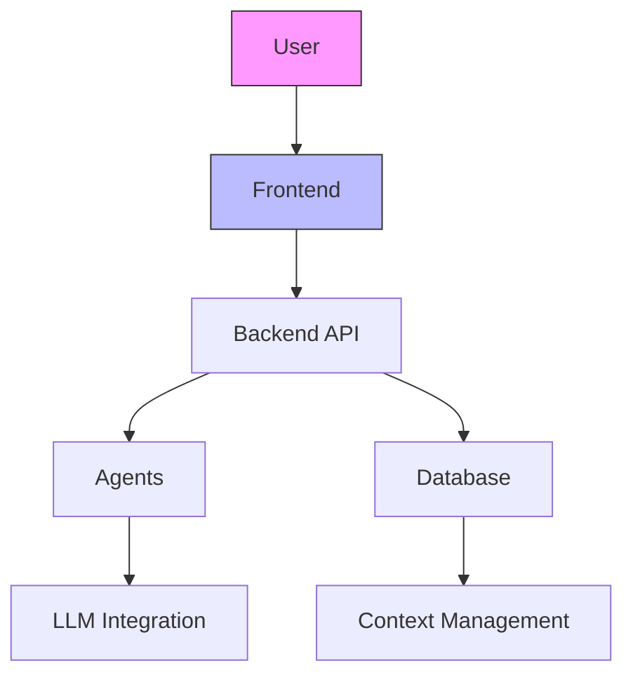

# AI Council: Complete Project Workflow Planning

## Executive Summary
This document provides a comprehensive plan for the AI Council project workflow, covering the complete development lifecycle from initial overview to production deployment. The plan includes agent/skill inventory, workflow definition, quality gates, and implementation strategy.

## Project Context
- **Two Python systems:** frontend (Streamlit) and backend (FastAPI)
- **Backend components:** PostgreSQL storage, local LLM integration (Mistral 7B)
- **Deployment:** Docker-based with docker-compose.yml for easy setup
- **Objective:** Structured workflow from overview document to reviewed, tested, and deployed code

## Key Requirements
- End-to-end workflow automation
- Automated quality gates at each stage
- Clear separation between agents (orchestration) and skills (automated tasks)
- Comprehensive testing and validation
- CI/CD integration for continuous quality assurance

## Current Setup Analysis

### CRITICAL CORRECTION: Architecture Creation Misclassification

**USER INSIGHT:** "Going from the system document to an architectural document is also a complex process defining how user requirements in the system document could be turned into architecture, this doesn't seem like a skill to me"

**ANALYSIS:** The user is absolutely correct. There's a fundamental flaw in the current classification:

### The Core Issue

**Current Misclassification:**
- **arch_skill** is incorrectly handling architecture creation work
- **arch_skill** should ONLY do validation and diagram generation (Skill-level work)
- **MISSING:** Architecture creation agent to transform system requirements → architecture design

### Correct Classification

**system_doc_creator (Agent) ✅ CORRECT**
- Transforms high-level overview → detailed system specification
- Complex multi-step process requiring decision-making
- High creativity and synthesis required

**architecture_creator (Agent) ❌ MISSING**
- Should transform system requirements → technical architecture
- Complex design decisions and trade-off analysis
- High architectural expertise required

**arch_skill (Skill) ⚠️ MISUSED**
- Should ONLY do validation and diagram generation
- Rule-based checks and visual representation
- Low complexity, automated tasks

### Why architecture_creator Must Be an Agent

1. **Complex Transformation Required:**
   - Input: System requirements (what the system should do)
   - Output: Technical architecture (how the system will work)
   - Process: Requires architectural expertise, pattern selection, trade-off analysis

2. **Architectural Decision-Making:**
   - Choose between different architectural patterns
   - Balance scalability, performance, maintainability
   - Make technology stack decisions
   - Design component interactions and data flows

3. **Creative Problem-Solving:**
   - Translate functional requirements into technical design
   - Handle ambiguous or conflicting requirements
   - Innovate solutions for complex problems
   - Ensure architecture meets non-functional requirements

### Correct Workflow


### Complexity Comparison

| Component | Type | Complexity | Decision-Making | Creativity |
| --------- | ---- | ---------- | --------------- | ---------- |
| system_doc_creator | Agent | High | Significant | High |
| architecture_creator | Agent | High | Significant | High |
| arch_skill | Skill | Low | Minimal | Low |
| arch_task_generator | Agent | High | Significant | High |

### Why This Matters

**Agents handle complex transformations:**
- system_doc_creator: Overview → System Specification
- architecture_creator: Requirements → Technical Architecture (including Mermaid diagrams in markdown)
- arch_task_generator: Architecture → Implementation Tasks

**Skills handle focused validation:**
- arch_skill: Architecture validation and ASCII diagram generation
- doc_skill: Documentation quality checks
- code_skill: Code quality validation

### Diagram Generation Responsibilities

**arch_skill (Skill) - ASCII Diagrams**

- Generates simple ASCII architecture diagrams
- Quick visual representation for validation
- Output: architecture_diagram.txt (plain text)
- Purpose: Rapid structure visualization and validation

**architecture_creator (Agent) - Mermaid Diagrams**

- Generates sophisticated Mermaid diagrams in markdown
- Creates multiple diagram types (flowcharts, sequence, class diagrams)
- Output: Embedded in architecture documentation (markdown)
- Purpose: Professional architecture documentation and communication

### Diagram Type Examples

**arch_skill ASCII Output (current)**

```text
┌───────────────────────────────────────┐
│           AI Council System           │
├─────────────┬─────────────┬───────────┤
│   Frontend  │   Backend   │ Database  │
└─────────────┴─────────────┴───────────┘
```

**architecture_creator Mermaid Output (proposed)**



### Rationale for This Division

1. **Complexity Appropriateness:**
   - ASCII generation: Simple, rule-based (Skill-level)
   - Mermaid generation: Complex, requires architectural understanding (Agent-level)

2. **Workflow Integration:**
   - arch_skill: Quick validation during development
   - architecture_creator: Professional documentation generation

3. **Output Quality:**
   - ASCII: Quick, simple, machine-readable
   - Mermaid: Professional, visual, human-readable

4. **Tooling Requirements:**
   - ASCII: Basic text manipulation
   - Mermaid: Architectural knowledge + markdown integration

This division ensures each component operates at the appropriate complexity level while providing comprehensive diagram support across the workflow.

### Existing Skills Fit Analysis
- **doc_skill** ✅ - Critical for documentation quality enforcement throughout workflow
- **code_skill** ✅ - Essential for code quality gates in development phase
- **test_skill** ✅ - Core component of testing quality gate
- **arch_skill** ✅ - Important for architecture validation and diagram generation

### Architecture Components Relationship

```text
arch_skill (Validation & Diagrams) → arch_task_generator (Task Breakdown)
```

**arch_skill** provides the foundation:
- Validates project structure and architecture compliance
- Generates architecture diagrams for visualization
- Ensures architectural consistency

**arch_task_generator** builds on this foundation:
- Takes validated architecture as input
- Breaks down architecture into implementable tasks
- Creates work breakdown structure for development

### Workflow Integration

1. arch_skill validates architecture and generates diagrams
2. arch_task_generator analyzes architecture to create implementation tasks
3. Tasks feed into development workflow for execution

### Skills have associated shell scripts
- check_docs.sh, lint_code.sh, run_tests.sh, generate_diagram.sh

### Agents use TOML configuration with system prompts
- Simple, effective configuration approach
- Easy to extend for new agents

### Project structure
- overview.md, backend/, frontend/, docker-compose.yml
- Well-organized foundation for the workflow

### Current capabilities
- ✅ Documentation structure checking
- ✅ Python code linting  
- ✅ Test execution with coverage
- ✅ Architecture diagram generation
- ✅ System document creation
- ✅ Architecture task generation

### All existing components fit well into the proposed workflow

## Identified Gaps
- No deployment validation agent/skill
- No database migration management
- No Docker/compose validation
- No CI/CD pipeline integration
- No backup/restore functionality
- No performance testing
- No security scanning

## Phase 1: Exploration (COMPLETED)
✓ Reviewed existing .vibe directory structure
✓ Understood current agents and their capabilities
✓ Identified gaps in current setup

## Phase 2: Agent/Skill Planning

### Proposed Additional Agents
1. **deployment_validator** - Validates Docker setup and deployment readiness
2. **db_migration_manager** - Handles database schema migrations
3. **ci_cd_integrator** - Manages CI/CD pipeline configuration
4. **backup_manager** - Handles backup/restore functionality
5. **security_auditor** - Performs security scanning and vulnerability checks
6. **dependency_analyzer** - Analyzes and summarizes dependency updates and impacts

### New Agent: dependency_analyzer
- **Purpose:** Monitor dependency updates, analyze changes, summarize impacts
- **Key Functions:**
  - Track dependency versions and updates
  - Analyze changelogs and breaking changes
  - Assess impact on current codebase
  - Generate summary reports for user review
  - Provide update recommendations
- **Integration Points:**
  - Pre-update analysis in development workflow
  - Post-update verification
  - Continuous monitoring for security updates

### Proposed Additional Skills
1. **deployment_skill** - Docker/compose validation and deployment checks
2. **database_skill** - Database migration and schema management
3. **security_skill** - Security scanning and vulnerability detection
4. **performance_skill** - Performance testing and optimization
5. **backup_skill** - Backup and restore operations

### Agent vs Skill Boundaries
- **Agents:** Complex, multi-step workflows requiring decision making
- **Skills:** Focused, automated tasks with clear success/failure criteria
- **Rule of thumb:** If it requires orchestration → Agent. If it's a single task → Skill.

### Agent/Skill Inventory

#### Agents (Complex Transformation & Orchestration)

| Component | Purpose | Status | Workflow Phase | Complexity |
| --------- | ------- | ------ | -------------- | ---------- |
| system_doc_creator | Transforms overview → detailed system spec | Existing | Overview → System Doc | High |
| architecture_creator | CRITICAL: Transforms system reqs → architecture design | Proposed | System Doc → Architecture | High |
| arch_task_generator | Generates architecture tasks | Existing | Architecture → Implementation | High |
| deployment_validator | Validates deployment setup | Proposed | Development → Deployment | Medium |
| db_migration_manager | Manages database migrations | Proposed | Development | Medium |
| ci_cd_integrator | CI/CD pipeline management | Proposed | All phases | High |
| backup_manager | Backup/restore operations | Proposed | Production | Medium |
| security_auditor | Security auditing | Proposed | All phases | High |
| dependency_analyzer | Dependency analysis & updates | Proposed | Development | High |

#### Skills (Focused Automation & Validation)

| Component | Purpose | Status | Workflow Phase | Complexity |
| --------- | ------- | ------ | -------------- | ---------- |
| doc_skill | Documentation quality checks | Existing | All phases | Low |
| code_skill | Code quality validation | Existing | Development | Low |
| test_skill | Testing and coverage | Existing | Testing | Low |
| arch_skill | Architecture validation & ASCII diagrams | Existing | Architecture | Low |
| deployment_skill | Deployment validation | Proposed | Deployment | Low |
| database_skill | Database management | Proposed | Development | Low |
| security_skill | Security scanning | Proposed | All phases | Low |
| performance_skill | Performance testing | Proposed | Testing | Low |
| backup_skill | Backup operations | Proposed | Production | Low |

## Phase 3: Workflow Definition

### Complete Workflow with Quality Gates


### Quality Gate Integration

**document_review_agent** is integrated at three critical points:

1. **After system_doc_creator** - Reviews system document for quality
2. **After architecture_creator** - Validates architecture against requirements
3. **After arch_task_generator** - Validates task breakdown completeness

### Enhanced Workflow Benefits
- ✅ Early error detection
- ✅ User confirmation points
- ✅ Quality assurance at each phase
- ✅ Complete audit trail
- ✅ Risk reduction

### Document Types and Relationships
1. **Overview Document** (overview.md) - High-level concepts and goals
2. **System Document** - Detailed system specification (generated by system_doc_creator Agent)
3. **Architecture Document** - Technical architecture (generated by architecture_creator Agent)
4. **Implementation Tasks** - Breakdown of work items (generated by arch_task_generator Agent)
5. **Architecture Validation** - Structure compliance (performed by arch_skill Skill)
6. **Technical Specification** - Detailed component specs
7. **API Specification** - API contracts and endpoints
8. **Test Plans** - Testing strategy and cases
9. **Deployment Guide** - Deployment instructions

### Quality Gates and Review Points

1. **Overview Review** - Conceptual validation
2. **System Document Generation** - Transformation quality (system_doc_creator Agent)
3. **System Document Review** - document_review_agent validation (NEW)
4. **System Document Approval** - User sign-off
5. **Architecture Creation** - Technical design quality (architecture_creator Agent) NEW
6. **Architecture Review** - document_review_agent validation (NEW)
7. **Architecture Approval** - User sign-off
8. **Architecture Validation** - Structure compliance (arch_skill Skill)
9. **Task Generation** - Implementation breakdown (arch_task_generator Agent)
10. **Task Review** - document_review_agent validation (NEW)
11. **Task Approval** - User sign-off
12. **Code Quality Gate** - Automated checks (code_skill, test_skill)
13. **Security Review** - Vulnerability scanning (security_skill)
14. **Performance Review** - Performance testing (performance_skill)
15. **Dependency Review** - Impact analysis (dependency_analyzer)
16. **Deployment Validation** - Environment readiness (deployment_skill)
17. **Production Sign-off** - Final approval

### Enhanced Workflow with Dependency Management

```text
Development Phase → Dependency Update → dependency_analyzer → Impact Report → User Review → Approved/Rejected
```

### Workflow Diagram

```text
┌───────────────────────────────────────────────────────────────────────────────┐
│                        AI COUNCIL DEVELOPMENT WORKFLOW                        │
├─────────────┬─────────────┬─────────────┬─────────────┬─────────────┬───────────┤
│  Overview    │ System Doc  │ Architecture│ Implementation│ Development │ Testing   │
│  Document    │             │ Document    │ Tasks       │             │           │
└─────────────┴─────────────┴─────────────┴─────────────┴─────────────┴───────────┘
                    │                 │                 │               │
                    ▼                 ▼                 ▼               ▼
┌───────────────────────────────────────────────────────────────────────────────┐
│                        QUALITY GATES & AUTOMATION                             │
├─────────────┬─────────────┬─────────────┬─────────────┬─────────────┬───────────┤
│ Code Quality │ Security    │ Performance │ Deployment  │ Production  │
│ (code_skill)│ (security_skill)│ (performance_skill)│ (deployment_skill)│ Sign-off  │
└─────────────┴─────────────┴─────────────┴─────────────┴─────────────┴───────────┘
```

## Phase 4: Implementation Strategy

### Actionable Steps
1. **CRITICAL PRIORITY (Next Session):**
   - Create architecture_creator agent ⭐ MOST IMPORTANT - fixes workflow gap
   - Create deployment_validator agent and deployment_skill
   - Create database_skill for migration management
   - Create dependency_analyzer agent for dependency management
   - Reclassify arch_skill usage to validation/diagrams only
   - Enhance existing agents/skills for current project needs

2. **Short-term (1-2 weeks):**
   - Implement security_skill and security_auditor
   - Create performance_skill for testing
   - Develop backup_skill for data protection
   - Integrate CI/CD pipeline

3. **Medium-term (2-4 weeks):**
   - Full workflow automation
   - Comprehensive testing suite
   - Documentation completion
   - User training materials

### Prioritization Based on Dependencies

```text
Critical Path:
1. Architecture creation agent ⭐ CRITICAL - fixes fundamental workflow gap
2. Deployment validation (needed for testing)
3. Database management (backend dependency)
4. Dependency analysis (critical for development stability)
5. Security scanning (required for production)
6. CI/CD integration (automated quality gates)
7. Backup functionality (data protection)
```

### Success Criteria
- **Phase 2:** Agent/skill inventory complete and prioritized
- **Phase 3:** Workflow documentation approved and visual diagram created
- **Phase 4:** Implementation plan with clear milestones and owners
- **Overall:** End-to-end workflow from overview to production with automated quality gates

### Timeline and Resource Allocation
- **Planning:** 1-2 sessions (current work)
- **Implementation:** 4-6 weeks (part-time)
- **Testing:** 2 weeks
- **Deployment:** 1 week
- **Total:** ~8 weeks to full workflow automation

## Next Steps
1. ✅ Analyze current agents/skills capabilities
2. ✅ Identify missing components
3. ✅ Define agent vs skill boundaries
4. ✅ Create comprehensive workflow documentation

## Recommendations
1. **Focus on deployment first** - Need to validate Docker setup for testing
2. **Database management** - Critical for backend functionality
3. **Dependency analysis** - Essential for stable development environment
4. **Security early** - Build security into the workflow from start
5. **Incremental implementation** - Start with most critical agents/skills
6. **Automation focus** - Maximize automated quality gates

### Dependency Analysis Benefits
- **Risk reduction:** Identify breaking changes before they impact development
- **Time savings:** Automated impact analysis instead of manual research
- **Better decisions:** Clear summaries of update implications
- **Security:** Proactive vulnerability detection in dependencies
- **Stability:** Controlled, informed update process

## Final Deliverable
This plan document will serve as the comprehensive workflow guide from overview to production, including:
- Complete agent/skill inventory
- Detailed workflow with quality gates
- Implementation roadmap with priorities
- Success criteria and timeline

## Approval Requested
Please review this plan and confirm:
1. Agent/skill inventory is comprehensive
2. Workflow covers all necessary steps
3. Prioritization aligns with project goals
4. Timeline is realistic

Once approved, I'll proceed with implementing the highest priority agents/skills.
