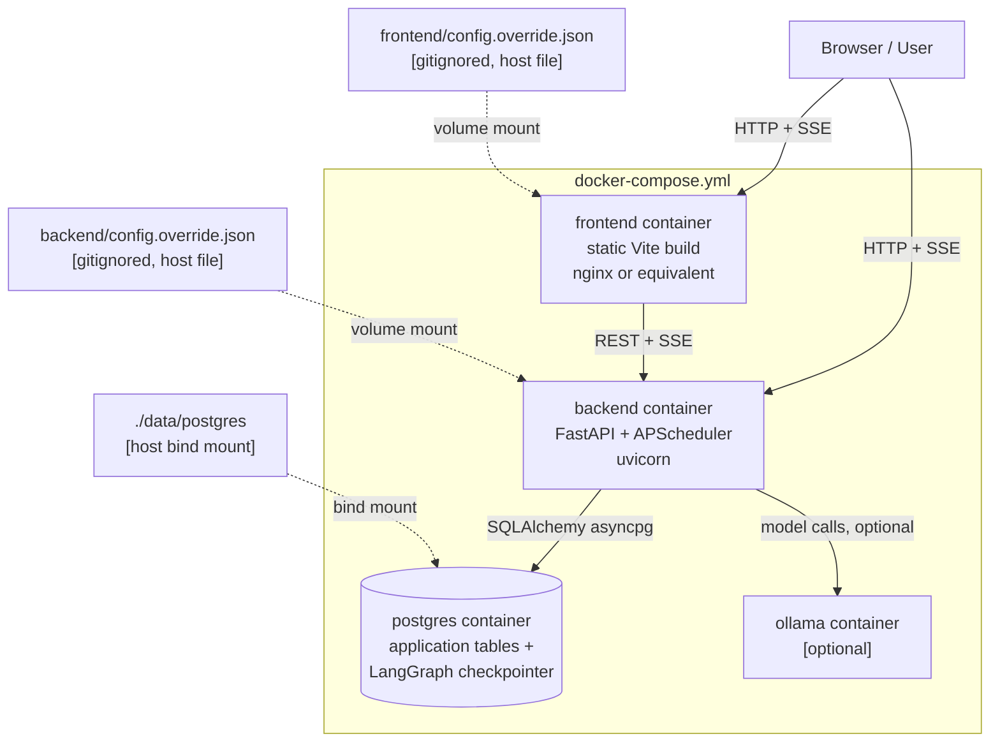
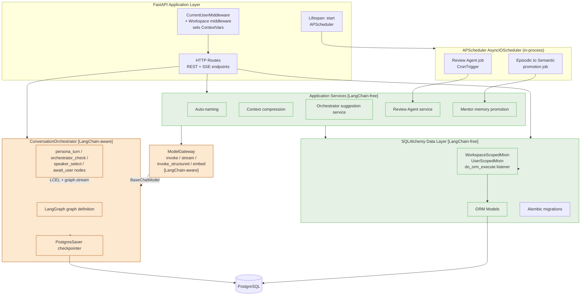
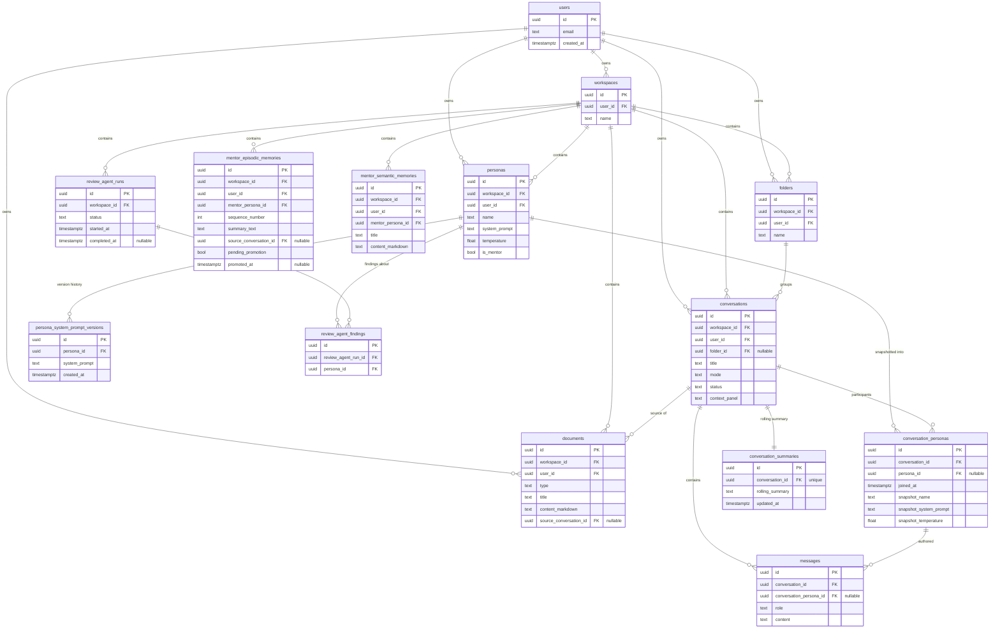
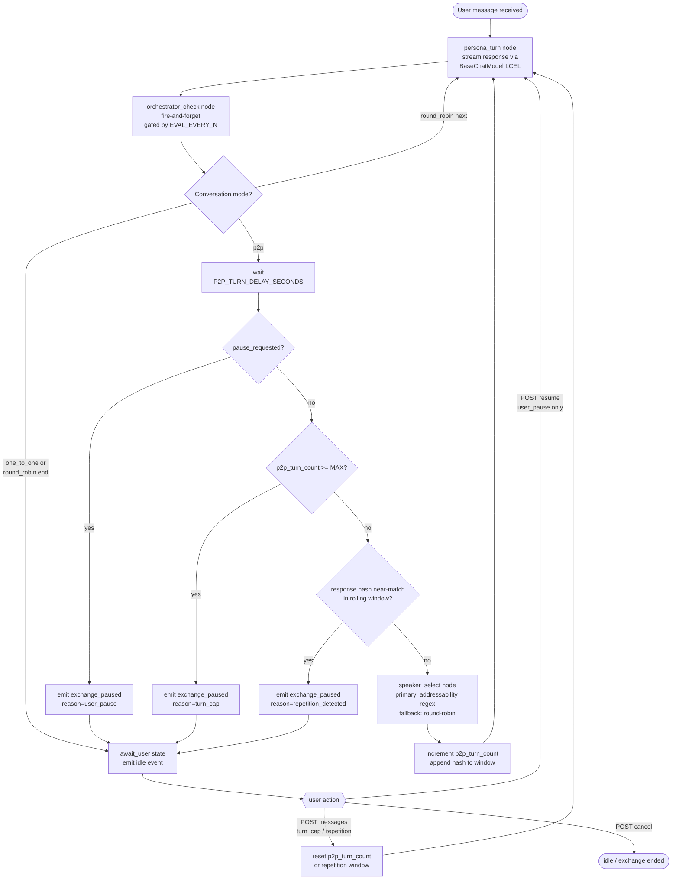
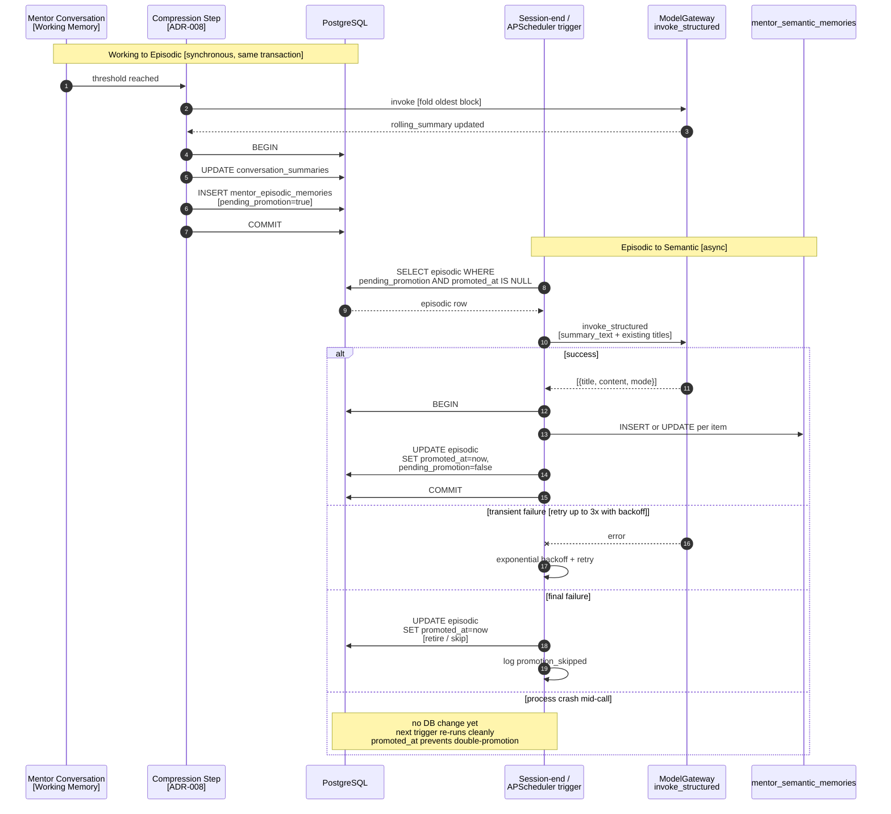
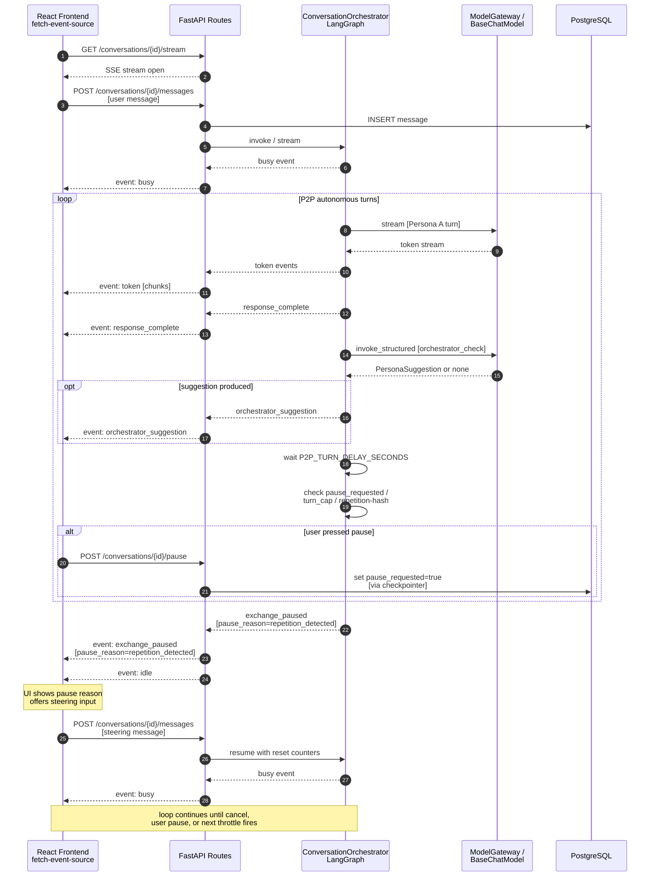
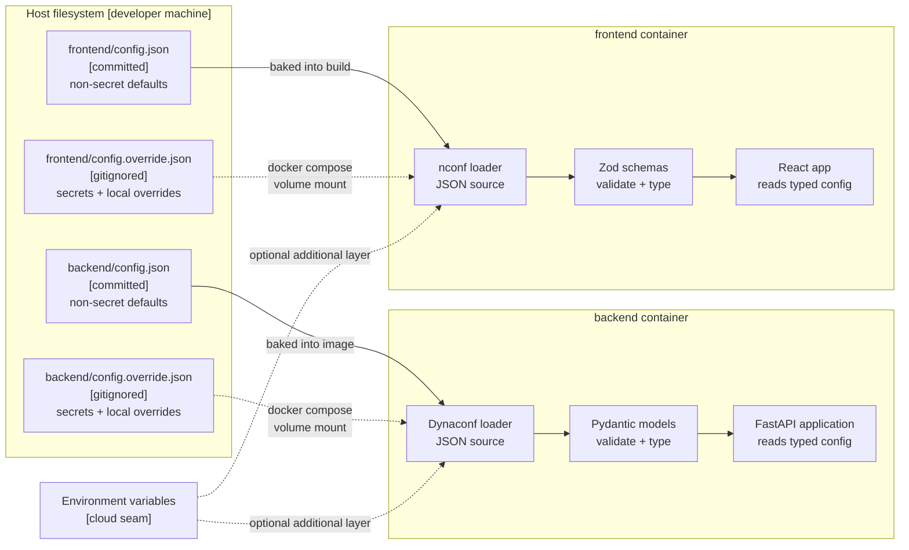

# System Diagrams

**Status:** Approved
**Date produced:** 2026-04-23
**Source:** Visual companion to `documentation/project/architecture.md`; reflects ADR-001 through ADR-017 in `documentation/decisions/architecture-decisions.md`.

---

## Purpose

This document is the visual companion to `architecture.md`. Each diagram illustrates one dimension of the approved architecture — deployment topology, internal component boundaries, the data model, the conversation graph, memory promotion flow, streaming and control signals, and configuration layering. The diagrams do not introduce any decisions; they depict decisions already recorded as ADRs. If a diagram and an ADR disagree, the ADR is correct and the diagram is a bug.

Read `architecture.md` first — it is the narrative; the diagrams below are references.

---

## 1. System Overview — Docker Compose Services

This diagram shows the canonical V1 deployment topology under `docker compose up` (ADR-005). Three services form the always-on set — `backend`, `frontend`, and `postgres`. An optional `ollama` service may be included in the compose stack or run externally; the model endpoint is chosen by configuration (ADR-002, ADR-015). Each mount on the backend and frontend containers is the local override file (gitignored) that layers over the committed base config (ADR-015). The diagram matters because it makes the "one compose file for local and V1 production" claim concrete — the only environmental variance is what is in the override files and which model endpoint they point at.

---

## 2. Backend Component Diagram — ModelGateway Boundary

This diagram shows the internal structure of the FastAPI backend and, critically, makes the ModelGateway boundary rule visible (ADR-001, ADR-002). Only the `ConversationOrchestrator` module (with its LangGraph nodes) and the `ModelGateway` itself may import from `langchain.*` or `langgraph.*`. Every other backend component — FastAPI routes, APScheduler jobs, services such as auto-naming and memory promotion — imports `ModelGateway` and never reaches for LangChain directly. The dashed line separates the "LangChain-aware" zone from the "LangChain-free" zone. This diagram matters because the boundary rule is the single most load-bearing architectural constraint on the backend codebase, and a picture makes violations obvious during review.

---

## 3. Data Model — Core Entities

This ER diagram shows the primary keys and foreign-key relationships of the core tables. It omits most non-FK columns to keep the relational skeleton readable. All Workspace-scoped tables carry `workspace_id` and `user_id` FKs (ADR-007, ADR-016) — these are shown explicitly because they are the isolation backbone. `conversation_personas` intentionally has no FK to `persona_system_prompt_versions`: snapshots store the System Prompt text directly so that deleting a Persona cannot corrupt historical Conversations (ADR-006). `messages.conversation_persona_id` is the provenance link from each message to the snapshot that produced it.

---

## 4. Conversation Graph — LangGraph Nodes and Edges

This flowchart is the logical shape of the `ConversationOrchestrator` LangGraph graph (ADR-001, ADR-012, ADR-017). A Persona turn runs; the `orchestrator_check` hook runs sequentially after it (fire-and-forget — it never gates the next turn); then a routing decision examines P2P state. Three conditional edges can divert from "next turn" to `await_user`: the hard turn cap, the repetition-hash throttle, and the user-initiated pause flag. When routed to `await_user`, the graph awaits a user message (POST) that resets the relevant counter and resumes. This diagram matters because it shows why P2P mode is bounded in depth — every autonomous turn passes all three throttles, independently.

---

## 5. Mentor Memory Promotion Flow

This sequence diagram traces a memory item from Working Memory through Episodic to Semantic (ADR-009, ADR-010). Working to Episodic is synchronous and shares the same DB transaction as the ADR-008 compression step — a brief inline pause is acceptable. Episodic to Semantic is asynchronous: triggered by session-end signals or the APScheduler schedule, it calls `ModelGateway.invoke_structured` outside the DB transaction, then wraps only the row updates in a transaction. The `pending_promotion` flag + `promoted_at` provide idempotency so a crash mid-call simply re-runs cleanly on the next trigger. The retry-and-retire path keeps the memory system unblocked under persistent LLM failure.

---

## 6. SSE Streaming and Control Signals — P2P Scenario

This sequence shows a full client-server interaction for a P2P conversation using the transport and signals from ADR-014 and ADR-017. The frontend opens one long-lived SSE stream per open Conversation. The user sends a message by POST — a separate request from the stream. The backend processes turns inside the LangGraph graph, emitting named SSE events (`busy`, `token`, `response_complete`, `orchestrator_suggestion`, `exchange_paused`). The user recovery path from a `turn_cap` or `repetition_detected` pause is a normal message POST, not a separate resume endpoint — see ADR-017. This diagram matters because it makes the asymmetric traffic pattern visible: the server streams, the client signals occasionally.

---

## 7. Configuration and Secrets Layering

This diagram shows the two-layer configuration stack on each side of the system (ADR-015). The backend stack is Dynaconf loading JSON, validated by Pydantic. The frontend stack is nconf loading JSON, validated by Zod. On both sides the committed base file (`config.json`) provides safe, non-secret defaults; the gitignored local override (`config.override.json`) is mounted into the container via a Docker Compose volume and layers over the base at load time. Secrets live only in the override file or in environment variables. This diagram matters because the "Infrastructure as Configuration" hard constraint lives and dies on this layering — the contract is that swapping a local LLM for a cloud API is a file change, not a code change.

---
